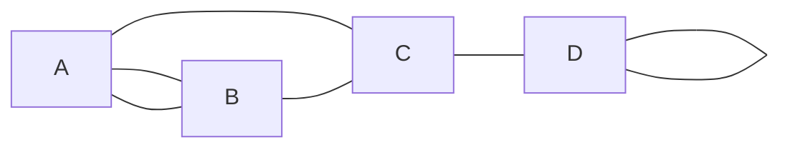

# Definition of Graph

A graph G = (V,E) consists of
  - a set V of vertices(nodes)
  - a collection E of pairs of vertices(nodes) from V called edges(arcs)

Example:

vertices = V : [A,B,C,D] edges = E : [[A,B],[A,B],[A,C], [B,C], [C,D], [D,D]]
# Undirected 
